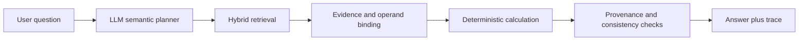

# DART Financial Agentic RAG

An evidence-first financial QA agent for Korean DART filings. It combines
hybrid retrieval, LLM-based semantic planning, deterministic calculation, and
traceable provenance so a reviewer can inspect how each numeric answer was
produced.

> Portfolio scope: the product is the single-agent `FinancialAgent` runtime.
> Multi-agent orchestration, cache promotion, and extended review machinery are
> experiments around the core, not the main product claim.

## The problem

Financial RAG can return a plausible answer while selecting the wrong row,
period, unit, subtotal, or entity. Free-form citations do not reveal which
operands were used or whether a displayed number was retrieved or calculated.

This project makes that path explicit:


```mermaid
flowchart LR
    Q["User question"] --> P["LLM semantic planner"]
    P --> R["Hybrid retrieval"]
    R --> E["Evidence and operand binding"]
    E --> C["Deterministic calculation"]
    C --> V["Provenance and consistency checks"]
    V --> A["Answer plus trace"]
```

The LLM interprets intent, concepts, and required operands. Code owns metadata
filtering, dense/BM25 fusion, row binding, arithmetic, unit handling, validation,
and final trace construction.

## Core engineering

### 1. Structure-aware DART ingest

The parser preserves filing structure such as `section_path`, table context,
period, unit, statement type, and consolidation scope. Structured cells and
their row/header relationships remain available after chunking.

### 2. Hybrid retrieval

- Chroma stores dense vectors. The canonical remote embedding runtime is OpenAI
  `text-embedding-3-large` with 3,072 dimensions.
- BM25 provides a separate sparse lexical signal.
- Reciprocal-rank fusion combines dense and sparse candidates.
- Metadata filters and deterministic structural reranking prefer compatible
  company, filing, period, section, table, and consolidation context.
- `retrieval_debug_trace` records the query bundle, filters, budgets, selected
  chunks, and policy decisions.

Contextual ingest may prepend an LLM- or metadata-generated context string
before embedding, but the Chroma vector itself is a dense embedding vector, not
a sparse vector and not a chat-model hidden state.

### 3. Agentic numeric reasoning

`FinancialAgent.run()` is the public runtime entry point. The graph plans the
question, retrieves evidence, resolves required operands, executes a formula,
and validates the result. Numeric output is carried through three canonical
surfaces:

- `answer_slots`: display-preserving values and operand roles
- `structured_result`: caller-facing structured answer
- `resolved_calculation_trace`: operands, formula, result, and provenance

### 4. Evidence-first acceptance

An answer is not accepted merely because generated prose sounds correct.
Numeric surfaces must agree with signed evidence values, selected rows must
preserve source identifiers, and calculated claims must be reproducible from
the trace.

### 5. Traceable evaluation

The repository includes contract tests, runtime-domain-term auditing, focused
benchmark profiles, and store-fixed eval-only workflows. Benchmark failures are
classified by parser, retrieval, ontology/policy, planning, evidence, calculation,
or projection layer instead of being patched with question-specific branches.

## Representative evidence

| Signal | Result | Interpretation |
| --- | ---: | --- |
| Expanded structural numeric set | recorded 9 / 9 PASS | Latest recorded store-fixed close; raw artifacts are not published with the repository |
| Plain-retrieval comparison | recorded 5 / 9 PASS | Earlier diagnostic baseline for row, denominator, and display/unit failures |
| Demo fixture contract | `fixture_contract_ready` | SHA-256-bound curated contract fixture passes internal cross-surface invariants; upstream lineage is not provided |
| Review surface aggregate | `review_surface_ready` | Reviewer fixtures and optional capability handoffs pass; publication checks are separate |
| Full unit test discovery | [current status](docs/overview/project_status.md) | The Python 3.13 workflow definition and latest local validation are tracked in one place |

The structural and plain results are retained engineering records, not a freshly
synchronized leaderboard ablation. Their raw artifacts are not checked in and
availability varies by run. The checked-in demo fixture is a separate evidence
surface; it does not reproduce or independently verify the benchmark runs. See
[portfolio_experiment_report.md](docs/overview/portfolio_experiment_report.md)
for the methodology and limitations.

## Five-minute review

The lightweight profile runs without the full ingest, ML, benchmark, and app
stack. Start with one command:

```bash
uv run --with-requirements requirements-review.txt python -m src.ops.portfolio_demo
```

Use the five minutes as follows:

1. Read the problem and core pipeline above.
2. Run the demo and inspect `Semantic Plan`, `Retrieval Trace`, `Calculation
   Trace`, citations, and critic acceptance.
3. Scan the representative result and scope boundary in the
   [portfolio one-pager](docs/overview/portfolio_one_pager.md).

The fixture-backed demo is a checked-in curated contract example, not a live
DART ingest or provider call. Its
[evidence manifest](tests/fixtures/portfolio_demo/evidence_manifest.json) binds
the fixture bytes, declares upstream lineage as `not_provided`, and scopes what
the command can establish. The hash proves fixture integrity, not runtime
provenance or authenticity. For deeper review-surface validation, run:

```bash
uv run --with-requirements requirements-review.txt python -m src.ops.portfolio_review_gates
uv run --with-requirements requirements-review.txt python -m src.ops.audit_runtime_domain_terms
```

`portfolio_review_gates` deliberately reports only
`review_surface_ready`; it does not run the unit suite or domain audit. The
[CI workflow](.github/workflows/validation.yml) is configured to combine those
checks for publication validation. A workflow definition is not a remote PASS;
observed status belongs in
[project_status.md](docs/overview/project_status.md).

Optional deep dives:

| Question | Document |
| --- | --- |
| How does one question move through the code? | [Question trace walkthrough](docs/overview/question_trace_walkthrough.md) |
| What evidence supports the result claims? | [Experiment report](docs/overview/portfolio_experiment_report.md) |
| What are the main implementation techniques? | [Technical highlights](docs/overview/technical_highlights.md) |
| How is the fixture-backed demo assembled? | [Demo walkthrough](docs/overview/portfolio_demo_walkthrough.md) |

## Run the API

The full profile is needed for ingest, Chroma, the API, benchmarks, and the full
test suite. Provider selection also depends on the configured API keys.
`.python-version` declares Python 3.13 as the repository reference line, and a
contract test keeps the workflow's Python literals aligned with it. Python 3.14
is not the publication gate and the current
LangChain stack may emit its Pydantic-v1 compatibility warning there.

```bash
uv run --with-requirements requirements.txt uvicorn main:app --reload --port 8000
uv run --with-requirements requirements.txt python -m unittest discover -s tests
```

Swagger UI is available at `http://localhost:8000/docs`.

## Scope boundary

| Surface | Role | Portfolio treatment |
| --- | --- | --- |
| Core runtime | parser, retrieval, evidence binding, calculation, answer projection | Main product story |
| Evaluation | evaluator, benchmarks, gates, regression fixtures | Supporting proof, never imported by the default runtime |
| Experimental | MAS facade, graph-expansion variants, cache/reflection promotion paths | Optional appendix; disabled or isolated by default |
| Legacy compatibility | flat mirrors, old import paths, callerless wrappers | Remove after caller and contract checks |

The active cleanup sequence and deletion criteria are documented in
[core_runtime_surface_refactoring_plan.md](docs/architecture/core_runtime_surface_refactoring_plan.md).

## Repository map

```text
main.py                    FastAPI entry point
src/api/                   HTTP boundary
src/agent/                 FinancialAgent graph and core runtime contracts
src/processing/            DART parsing and chunk preparation
src/storage/               embeddings, Chroma, BM25, and structure storage
src/config/                ontology, retrieval policy, and runtime config
src/experimental/mas/      optional multi-agent experiment
src/ops/                   evaluation, benchmark, and reviewer commands
tests/                     contract and regression tests
docs/                      reviewer guides and internal history
```

Internal status and experiment logs remain available for audit and historical
context, but they are not the recommended first-read path. Start with the
five-minute review above and open a deep dive only for the question you want to
inspect.
