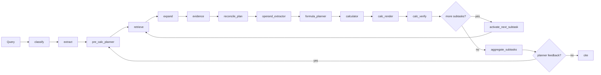

# Semantic Numeric Planner Design

## Goal

Improve numeric question handling by shifting from:

`query -> broad retrieval -> operand extraction -> calculation`

to:

`query -> semantic planning -> task-aware retrieval -> reconciliation -> calculation -> final synthesis`

This design is meant to reduce:

- wrong statement selection (`balance_sheet` vs `income_statement`)
- wrong scope selection (`consolidated` vs `separate`)
- wrong period pairing (`current` vs `prior`)
- wrong entity/segment selection (`company` vs subsidiary / segment)
- partial multi-metric answers (for example only returning debt ratio when both debt ratio and current ratio are requested)


## Non-goals

- Do not make the parser a full rule engine for finance.
- Do not make the pre-retrieval planner solve the calculation itself.
- Do not make the planner decide the exact final wording of the user-facing answer.
- Do not hard-reject every metadata mismatch; allow controlled fallback for `unknown`.


## Runtime Schema Direction

Within the DART-only scope, the internal source of truth should gradually move from scattered `calculation_*` fields toward:

- `tasks`
- `artifacts`
- parser-emitted `table_object` / `row_record` / `cell_record`

Current implementation status:
- parser now emits `table_object_json` and `table_row_records_json`
- runtime state now includes `tasks` and `artifacts`
- semantic planning, reconciliation, operand extraction, calculation planning, calculation execution, and aggregation emit first-pass artifact records
- legacy `calculation_*` fields still remain for evaluator compatibility and should be treated as derived runtime views, not the long-term canonical schema
- current scope remains DART-only; this schema work is meant to close the disclosure-analysis loop cleanly before any broader agent generalization


## End-to-end Flow



## Planner Direction

The planner is moving away from benchmark-shaped `metric_families` and toward a
material-gathering intermediate representation.

Current target IR:

- `operation_family`
- `required_operands`
  - each operand should carry at least:
    - `concept`
    - `label`
    - `role`
- `constraints`
  - `consolidation_scope`
  - `period_focus`
  - `entity_scope`
  - `segment_scope`

The planner should answer:

- what concepts are needed
- what operation relates those concepts
- what scope / period constraints apply

The planner should not answer:

- exactly how the final Korean sentence should be phrased
- whether the user should see only the final scalar or also intermediate values

That responsibility belongs to the final synthesizer.

### Current implementation status

- legacy metric-family planning still exists as a compatibility path
- concept-only ontology v3 draft is now available
- implicit numeric questions can be decomposed by an LLM concept planner
- planner output is lightly validated against:
  - allowed operations
  - ontology-defined concepts
  - basic role / shape constraints
- planner can now be re-entered in `replan` mode using `planner_feedback`

## Ontology Direction

The ontology is being reduced from a benchmark recipe book toward a reusable
DART concept catalog.

The active direction is:

- keep:
  - canonical concepts
  - aliases
  - concept groups
  - statement / section priors
  - lightweight binding preferences
- de-emphasize:
  - benchmark-shaped `metric_families`
  - query-specific formulas
  - one-off numerator / denominator recipes

Representative concept groups now include:

- `tangible_and_intangible_assets`
- `borrowings`

These let the planner expand shorthand query expressions into explicit operand
sets without turning ontology into a benchmark answer key.

## Planner Re-entry

`pre_calc_planner` is now reused for both initial planning and re-planning.

State fields used for this loop:

- `planner_mode`
- `planner_feedback`
- `plan_loop_count`

Replan behavior:

- downstream synthesizer emits `planner_feedback` when gathered materials are
  not enough to fully answer the original question
- planner is re-entered in `replan` mode
- it is instructed to append only missing tasks rather than overwrite the whole
  plan
- task appending and deduplication are enforced in Python code, not delegated to
  the LLM

This keeps graph topology simple while preserving patch-style planning behavior.


## Parser Contract

Parser metadata is the grounding layer that helps retrieval and operand selection remain strict without becoming brittle.

### Required chunk metadata

These fields should be available on numeric/table chunks whenever possible:

- `statement_type`
  - `balance_sheet`
  - `income_statement`
  - `cash_flow`
  - `summary_financials`
  - `notes`
  - `mda`
  - `unknown`
- `consolidation_scope`
  - `consolidated`
  - `separate`
  - `unknown`
- `period_labels`
  - for example `["2023", "2022"]`, `["당기", "전기"]`
- `period_focus`
  - `current`
  - `prior`
  - `multi_period`
  - `unknown`
- `unit_hint`
  - `원`, `천원`, `백만원`, `억원`, `%`, `unknown`
- `table_source_id`
  - stable per original table, even when split into multiple chunks
- `table_header_context`
  - compact textual representation of the original table header
- `header_propagated`
  - `true` if the chunk inherited header metadata after table splitting

### Parser invariants

- If a table is split, all child chunks must inherit:
  - `table_source_id`
  - `table_header_context`
  - `statement_type`
  - `consolidation_scope`
  - `period_labels`
  - `period_focus`
  - `unit_hint`
- Empty lists should not be emitted into vector-store metadata.
- `unknown` is acceptable; silent omission is preferred over wrong confident tags.


## Table-aware Parsing

Numeric grounding should not rely on plain-text chunk matching alone.

For financial statements and notes tables, the parser should produce:

1. a retrieval-friendly **table summary chunk**
2. a structured **table object**
3. optional **row-level candidate records**

This allows retrieval to find the right table first, then lets reconciliation and operand grounding work against structured rows/cells instead of loose text.

### Why this is needed

Plain chunk text is not enough for statement tables because:

- row labels may be far from the numeric cell
- multi-level headers carry period/scope meaning
- merged cells hide header inheritance
- similar metrics can coexist in the same table
  - for example `부채총계`, `유동부채`, `비유동부채`

The system should therefore treat tables as structured data objects, not just long text spans.


## Table Object Schema

Each original table should be represented by a canonical object before chunk splitting.

Current implementation status:
- `financial_parser.py` now expands `ROWSPAN/COLSPAN` into a canonical grid before formatting table text
- propagated table metadata includes `table_summary_text`, `table_row_labels_text`, `table_row_count`, `table_column_count`, and `table_has_spans`
- parser now also emits `table_row_records_json` containing structured row records
- reconciliation now supplements chunk candidates with row-aware candidates and prefers structured `rowrec` candidates when available
- operand extraction now consumes `rowrec` candidates directly for ready numeric subtasks, while broader row/cell-level grounding beyond these direct paths is still incremental

### Suggested schema

```json
{
  "table_id": "table_001",
  "source_section_path": "III. 재무에 관한 사항 > 2. 연결재무제표 > 2-1. 연결 재무상태표",
  "caption": "연결 재무상태표",
  "statement_type": "balance_sheet",
  "consolidation_scope": "consolidated",
  "unit_hint": "백만원",
  "period_labels": ["2023", "2022"],
  "period_focus": "multi_period",
  "header_rows": [
    ["과목", "2023", "2022"]
  ],
  "body_rows": [
    {
      "row_id": "table_001_row_014",
      "row_headers": ["부채총계"],
      "cells": [
        {
          "cell_id": "table_001_row_014_col_01",
          "value_text": "92,228,115",
          "column_headers": ["2023"],
          "normalized_value": 92228115000000,
          "normalized_unit": "KRW"
        },
        {
          "cell_id": "table_001_row_014_col_02",
          "value_text": "91,188,130",
          "column_headers": ["2022"],
          "normalized_value": 91188130000000,
          "normalized_unit": "KRW"
        }
      ]
    }
  ],
  "table_header_context": "연결 재무상태표 | 단위: 백만원 | 2023 | 2022"
}
```

### Minimum required fields

- `table_id`
- `statement_type`
- `consolidation_scope`
- `unit_hint`
- `period_labels`
- `header_rows`
- `body_rows`
- `table_header_context`


## Merged-cell Normalization

Merged headers should be resolved in code, not deferred to the LLM.

### Recommended normalization procedure

1. parse raw HTML/XML table into a grid model
2. expand `rowspan` / `colspan` into a full rectangular grid
3. propagate merged header labels downward/rightward
4. separate:
   - row-header region
   - column-header region
   - value-cell region
5. attach header stacks to each value cell

### Cell-level invariant

Every numeric cell used for grounding should be recoverable as:

```json
{
  "value_text": "92,228,115",
  "row_headers": ["부채총계"],
  "column_headers": ["2023", "당기"],
  "statement_type": "balance_sheet",
  "consolidation_scope": "consolidated",
  "unit_hint": "백만원",
  "table_id": "table_001"
}
```

This is the core structure that later stages should operate on.


## Table Summary Chunk

The retrieval system should not search the full table object directly.

Instead, each table should emit a lightweight summary chunk for vector/BM25 retrieval.

### Purpose

- identify the relevant table
- preserve enough context for ranking
- avoid forcing retrieval to infer row semantics from giant raw tables

### Suggested contents

- `caption`
- `statement_type`
- `consolidation_scope`
- `unit_hint`
- `period_labels`
- top row labels / important row labels
- section path
- optional nearby narrative context

### Example

```text
연결 재무상태표 | 단위: 백만원 | 기간: 2023, 2022
주요 행: 유동자산, 비유동자산, 자산총계, 유동부채, 비유동부채, 부채총계, 자본총계
section: III. 재무에 관한 사항 > 2. 연결재무제표 > 2-1. 연결 재무상태표
```

This summary chunk is for retrieval.
The structured table object remains the source of truth for grounding.


## Row Candidate Records

For numeric reconciliation and operand grounding, the parser should also emit row-oriented candidate records.

### Suggested row candidate schema

```json
{
  "candidate_id": "table_001_row_014",
  "table_id": "table_001",
  "row_headers": ["부채총계"],
  "row_label_text": "부채총계",
  "statement_type": "balance_sheet",
  "consolidation_scope": "consolidated",
  "unit_hint": "백만원",
  "period_labels": ["2023", "2022"],
  "cells": [
    {
      "value_text": "92,228,115",
      "column_headers": ["2023"],
      "normalized_value": 92228115000000,
      "normalized_unit": "KRW"
    },
    {
      "value_text": "91,188,130",
      "column_headers": ["2022"],
      "normalized_value": 91188130000000,
      "normalized_unit": "KRW"
    }
  ]
}
```

These row candidates should become the primary input to reconciliation for statement-style numeric questions.


## Retrieval Split: Table Discovery vs Operand Grounding

Retrieval should happen in two conceptual stages.

### Stage 1: table discovery

Use:

- original query
- semantic planner task query
- ontology retrieval keywords
- parser summary chunks

Goal:

- find the right table(s)

### Stage 2: operand grounding

Once a relevant table is found:

- operate on its row candidate records / structured rows
- select the row(s) matching required operands
- then select the correct period/scope cell

This is more robust than asking vector retrieval to directly surface exact operand rows every time.


## Table-aware Reconciliation

Reconciliation should evolve from text matching to structured table selection.

## Current Code Path vs Target Code Path

The phrase "use row/cell objects more directly" means changing which internal
representation downstream components consume.

### Current code path

Today the flow is effectively:

1. `financial_parser.py`
   - expands merged cells into a canonical grid
   - converts that grid back into `table_text`
   - emits chunk metadata such as `table_summary_text` and `table_row_labels_text`
2. `financial_graph.py`
   - retrieval returns chunk-like documents
   - reconciliation supplements them with lightweight `table_row` candidates
   - candidate matching still works primarily from:
     - `row_label`
     - `row_text`
     - `table_header_context`
     - metadata reranking
3. operand extraction
   - still extracts values from retrieved text / evidence text, not from a
     fully structured row or cell object

In short:

- parser reconstructs structure
- reconciliation reads a text-oriented proxy of that structure

### Target code path

The target flow is:

1. `financial_parser.py`
   - emits a canonical table object
   - emits structured row records
   - emits structured cell records with normalized values
2. retrieval
   - finds relevant tables using table summary chunks
3. reconciliation
   - selects the correct table object
   - selects the correct row object(s)
   - selects the correct cell(s) by period/scope
4. operand extraction
   - reads `normalized_value`, `normalized_unit`, `row_headers`,
     `column_headers` directly from structured objects

In short:

- retrieval finds the table
- grounding operates on structured rows/cells directly
- text becomes evidence/support, not the primary numeric substrate

### Practical meaning of the next migration

The next architectural step is not "more retrieval".
It is changing reconciliation and operand extraction from:

- `candidate["text"]` driven selection

to:

- `candidate["row_headers"]`
- `candidate["cells"]`
- `cell["column_headers"]`
- `cell["normalized_value"]`

driven selection.

### Current deterministic phase

The first implementation currently does:

- candidate text matching against operand labels / aliases
- metadata-based reranking

This is useful as a bootstrap, but it is not the desired long-term strategy.

### Desired structured phase

For numeric statement questions:

1. identify candidate tables from retrieval
2. rank tables by:
   - `statement_type`
   - `consolidation_scope`
   - `period_labels`
   - section path
3. inspect table row candidates
4. match required operands at the row level
5. select period/scope-specific cells
6. emit:
   - ready
   - retry retrieval
   - insufficient operands

### What should *not* be primary logic

- hand-maintained alias matching alone
- raw substring matching against giant table text
- free-form LLM guessing over malformed tables

Aliases remain useful, but only as a secondary hint layer.


## Role of LLM vs Code in Table Handling

### Code should handle

- rowspan / colspan normalization
- header propagation
- row/cell extraction
- unit normalization
- period header mapping
- table / row candidate construction

### LLM should handle

- semantic planner interpretation of the query
- ambiguous row-choice resolution when multiple structurally valid rows remain
- post-hoc explanation / rendering

### LLM should *not* be the primary table parser

If the table structure can be recovered deterministically, do it in code first.


## Recommended Evolution Path

1. keep current parser metadata contract
2. add canonical table object generation
3. emit table summary chunks for retrieval
4. emit row candidate records for grounding
5. make reconciliation consume row candidates first
6. reserve alias matching for fallback only


## Ontology V2

The existing ontology already supports:

- `metric_families`
- `preferred_sections`
- `supplement_sections`
- `query_hints`
- `row_patterns`
- `components`

The next version should extend that structure instead of replacing it.

### File

- [src/config/financial_ontology.json](</C:/Users/geonj/Desktop/research agent/src/config/financial_ontology.json>)

### New metric-family fields

- `aliases`
  - alternate phrasings of the metric itself
- `statement_type_hints`
  - preferred parser `statement_type` values
- `retrieval_keywords`
  - query-time operand/label hints
- `default_constraints`
  - `period_focus`, `entity_scope`, `segment_scope`
- `formula_family`
  - `ratio`, `difference`, `growth_rate`, `absolute`, `trend`

### New component fields

- `aliases`
  - alternate labels for each operand
- `required`
  - whether the operand is mandatory for the metric

### Example

```json
{
  "metric_families": {
    "debt_ratio": {
      "display_name": "부채비율",
      "intent_keywords": ["부채비율", "부채 비율", "debt ratio"],
      "aliases": ["부채비율"],
      "preferred_sections": ["재무상태표", "요약재무정보", "위험관리 및 파생거래"],
      "supplement_sections": ["재무상태표", "요약재무정보"],
      "query_hints": ["부채총계", "자본총계", "연결", "당기"],
      "retrieval_keywords": ["부채총계", "자본총계", "재무상태표"],
      "statement_type_hints": ["balance_sheet", "summary_financials"],
      "formula_family": "ratio",
      "result_unit": "PERCENT",
      "default_constraints": {
        "period_focus": "current",
        "entity_scope": "company",
        "segment_scope": "none"
      },
      "components": {
        "numerator": {
          "name": "부채총계",
          "aliases": ["총부채"],
          "keywords": ["부채총계", "총부채"],
          "required": true,
          "preferred_sections": ["재무상태표", "요약재무정보"]
        },
        "denominator": {
          "name": "자본총계",
          "aliases": ["총자본"],
          "keywords": ["자본총계", "총자본"],
          "required": true,
          "preferred_sections": ["재무상태표", "요약재무정보"]
        }
      }
    }
  }
}
```


## Pre-Retrieval Semantic Planner

### Purpose

The planner should answer:

- What metric is being asked?
- Which operands are required?
- Which scope constraints apply?
- Is this one task or multiple tasks?
- Can retrieval proceed confidently, or should we fallback?

### File

- [src/agent/financial_graph.py](</C:/Users/geonj/Desktop/research agent/src/agent/financial_graph.py>)

### New state fields

Add to `FinancialAgentState`:

- `semantic_plan: Dict[str, Any]`
- `calc_subtasks: List[Dict[str, Any]]`
- `retrieval_queries: List[str]`
- `active_subtask_index: int`
- `active_subtask: Dict[str, Any]`
- `subtask_results: List[Dict[str, Any]]`
- `subtask_debug_trace: Dict[str, Any]`
- `reconciliation_result: Dict[str, Any]`

### Structured output models

```python
class OperandRequirement(BaseModel):
    label: str
    aliases: List[str] = Field(default_factory=list)
    role: str = ""
    required: bool = True


class TaskConstraints(BaseModel):
    consolidation_scope: str = "unknown"
    period_focus: str = "unknown"
    entity_scope: str = "unknown"
    segment_scope: str = "none"


class RetrievalTask(BaseModel):
    task_id: str
    metric_family: str
    metric_label: str
    query: str
    required_operands: List[OperandRequirement] = Field(default_factory=list)
    preferred_statement_types: List[str] = Field(default_factory=list)
    preferred_sections: List[str] = Field(default_factory=list)
    constraints: TaskConstraints = Field(default_factory=TaskConstraints)


class SemanticPlan(BaseModel):
    status: Literal["ok", "needs_clarification", "fallback_general_search"]
    fallback_to_general_search: bool = False
    tasks: List[RetrievalTask] = Field(default_factory=list)
    planner_notes: List[str] = Field(default_factory=list)
```

### Planner behavior

The planner should:

- use ontology as prior knowledge
- not invent formulas outside ontology-backed reasoning
- allow:
  - `status="needs_clarification"`
  - `fallback_to_general_search=true`

Examples:

- Explicit multi-task:
  - `부채비율과 유동비율을 각각 계산해 줘`
- Implicit single-task:
  - `부채비율을 계산해 줘`
- Implicit single-task with hidden operands:
  - `FCF를 계산해 줘`


## Task-Aware Retrieval

### Purpose

Retrieval should no longer depend on one broad query only.

It should use:

- original query
- task-specific query
- metric aliases
- required operand labels / aliases
- ontology retrieval keywords
- parser metadata expectations

### Query bundle

For each task, build one or more retrieval queries such as:

- `2023년 연결기준 부채총계 자본총계 재무상태표`
- `2023년 연결기준 유동자산 유동부채 재무상태표`

### Retrieval tiers

- `Tier 1`
  - metadata strongly matches:
    - statement type
    - consolidation
    - period
- `Tier 2`
  - some metadata unknown, but strong semantic similarity
- `Tier 3`
  - narrative / supporting chunks

### Retrieval metadata additions

Retrieved candidate objects should track:

- `matched_task_ids`
- `retrieval_source_query`
- `retrieval_tier`


## Post-Retrieval Reconciliation

### Purpose

This layer compares:

- what the planner expected
- what retrieval actually found

It decides whether we can:

- proceed
- retry retrieval
- stop with insufficient operands

### Structured output model

```python
class OperandMatch(BaseModel):
    label: str
    matched: bool
    candidate_ids: List[str] = Field(default_factory=list)
    reason: str = ""


class ReconciliationDecision(BaseModel):
    status: Literal["ready", "retry_retrieval", "insufficient_operands"]
    task_id: str
    matched_operands: List[OperandMatch] = Field(default_factory=list)
    missing_operands: List[str] = Field(default_factory=list)
    retry_queries: List[str] = Field(default_factory=list)
    notes: List[str] = Field(default_factory=list)
```

### Behavior

- If all required operands are found:
  - `ready`
- If some are missing but retriable:
  - `retry_retrieval`
- If still missing after retry:
  - `insufficient_operands`

This is the place to enforce:

- same statement type preference
- same table preference
- same period / same consolidation preference

### Phase 1 implementation scope

The first implementation should stay deterministic and narrow:

- build operand candidates from:
  - `evidence_items`
  - `retrieved_docs`
- match candidates by:
  - operand label
  - operand aliases
  - simple text containment
- score candidates by:
  - matching `statement_type`
  - matching `consolidation_scope`
  - matching `period_labels`
  - presence of shared `table_source_id`
- return only three outcomes:
  - `ready`
  - `retry_retrieval`
  - `insufficient_operands`

This first phase should not yet:

- use an LLM inside reconciliation
- do full entity/segment scope reasoning
- execute subtask loops in parallel
- make hard decisions from weak fuzzy evidence alone


## Operand Extraction and Calculation

The existing calculation pipeline should remain mostly intact:

- `operand_extractor`
- `formula_planner`
- `calculator`
- `calc_render`
- `calc_verify`

The key change is that these nodes should read from `active_subtask` first.

### New helper accessors

Recommended helpers in `financial_graph.py`:

- `_calc_query(state)`
- `_calc_topic(state)`
- `_calc_metric_family(state)`
- `_calc_required_operands(state)`
- `_calc_constraints(state)`

This avoids a large invasive refactor.


## Subtask Loop

Multiple semantic tasks should be processed as an ordered loop.

### New graph nodes

- `pre_calc_planner`
- `reconcile_plan`
- `activate_next_subtask`
- `aggregate_subtasks`

### New routing function

- `_route_after_calc_verify`

### Loop behavior

1. `pre_calc_planner` creates `calc_subtasks`
2. first task becomes `active_subtask`
3. run retrieval + reconciliation + calculation
4. append task result to `subtask_results`
5. if more tasks remain:
   - `activate_next_subtask`
   - clear single-task calculation state
   - go back to `reconcile_plan`
6. otherwise:
   - `aggregate_subtasks`

### Current implementation status

Implemented so far:

- ontology v2
- deterministic `pre_calc_planner`
- query-bundle retrieval
- deterministic `reconcile_plan`
- calculation nodes reading `active_subtask`
- sequential `advance_subtask -> aggregate_subtasks` loop

Not yet implemented:

- subtask-parallel execution
- LLM-based reconciliation fallback
- explicit re-retrieval after subtask aggregation
- richer entity / segment scope reconciliation


## Aggregation

### First implementation

Keep the first version deterministic.

Example:

- `부채비율은 25.4%이고, 유동비율은 258.8%입니다.`

### Partial failure handling

If one task succeeds and another fails:

- preserve successful answers
- explicitly state the missing operand reason for the failed one

Example:

- `부채비율은 25.4%로 계산됩니다. 다만 유동비율은 유동부채 근거를 충분히 찾지 못해 계산하지 못했습니다.`


## Recommended Implementation Order

1. Extend ontology schema in [financial_ontology.json](</C:/Users/geonj/Desktop/research agent/src/config/financial_ontology.json>)
2. Extend [ontology.py](</C:/Users/geonj/Desktop/research agent/src/config/ontology.py>) helper methods
3. Add semantic plan state fields in [financial_graph.py](</C:/Users/geonj/Desktop/research agent/src/agent/financial_graph.py>)
4. Implement `pre_calc_planner`
5. Make `retrieve` consume `retrieval_queries`
6. Implement `reconcile_plan`
7. Make calculation nodes read `active_subtask`
8. Add `activate_next_subtask` and `aggregate_subtasks`
9. Validate on:
   - `MIX_T1_021`
   - one implicit single-metric ratio question
   - one numeric trend/comparison question


## Immediate Validation Targets

- `MIX_T1_021`
  - explicit multi-metric ratio question
- one debt/current/roe-style question
  - implicit operand planning
- one trend/comparison numeric question
  - period-aware operand grouping


## Key Design Principles

- Use parser metadata to preserve document context.
- Use ontology to encode stable financial prior knowledge.
- Use the planner to decide what to retrieve, not to solve the answer directly.
- Use reconciliation to prevent confident wrong calculations.
- Prefer soft metadata bias plus tiered fallback over overly strict hard filtering.
