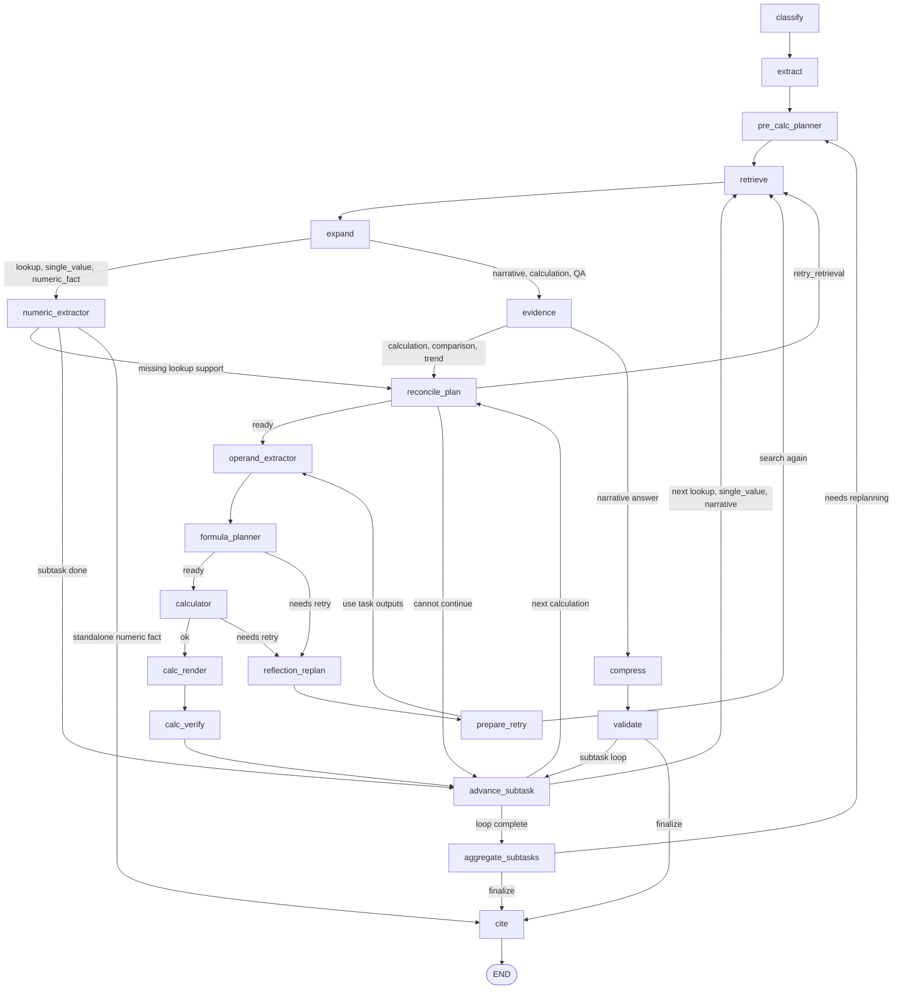

# Question Trace Walkthrough

이 문서는 질문 1개가 현재 코드에서 어떻게 흐르는지 따라가기 위한
walkthrough다. 기준은 2026-06-22 PR #77 merge 이후의 single-agent runtime이다.

같이 보면 좋은 문서:

- [Codebase Map](codebase_map.md)
- [Runtime Flow And Roles](runtime_flow_roles.md)
- [Agent Runtime Contract](../architecture/agent_runtime_contract.md)
- [Core Runtime Surface Refactoring Plan](../architecture/core_runtime_surface_refactoring_plan.md)

## 1. 먼저 알아야 할 읽기 원칙

`FinancialAgent`를 helper부터 읽으면 거의 반드시 길을 잃는다. 읽는 순서는
항상 아래가 먼저다.

1. [src/agent/financial_graph.py](../../src/agent/financial_graph.py)의
   `_build_graph()`
2. 같은 파일의 `run()`
3. [src/agent/financial_graph_state.py](../../src/agent/financial_graph_state.py)의
   graph state contract
4. 각 graph node의 mixin 구현
5. helper/module 내부

현재 runtime의 핵심 계약은 `answer`, `structured_result`,
`resolved_calculation_trace`, `review_trace`, `debug_bundle`이다. 오래된 flat
field도 아직 반환되지만, 새 코드가 먼저 봐야 하는 표면은 named projection이다.

## 2. 한 화면으로 보는 호출 체인

```text
POST /api/query
  -> src/api/financial_router.py::query()
  -> FinancialAgent.run(query, report_scope=None)
  -> LangGraph invoke(initial_state)
  -> classify
  -> extract
  -> pre_calc_planner
  -> retrieve
  -> expand
  -> numeric_extractor or evidence
  -> reconcile_plan
  -> operand_extractor
  -> formula_planner
  -> calculator
  -> calc_render
  -> calc_verify
  -> advance_subtask
  -> aggregate_subtasks
  -> cite
  -> run() output projection
  -> QueryResponse
```

숫자 질문은 보통 `calc_subtasks`를 만들고 subtask loop를 돈다. narrative 질문은
`retrieve -> expand -> evidence -> compress -> validate -> cite` 쪽으로 짧게
흐른다.

## 3. 서비스 진입점

주요 파일:

- [main.py](../../main.py)
- [src/api/financial_router.py](../../src/api/financial_router.py)

`main.py`는 FastAPI app을 띄우고 startup에서 singleton component를 만든다.
질문 처리 시점에는 parser/store/agent를 새로 만들지 않고, 이미 초기화된
`FinancialAgent`를 호출한다.

`POST /api/query`의 핵심은 아래 한 줄이다.

```python
result = agent.run(req.question)
```

API layer는 분석을 하지 않는다. `FinancialAgent.run()` 결과에서 answer,
citations, `structured_result`, `resolved_calculation_trace` 같은 public field를
꺼내 응답으로 포맷한다.

## 4. `FinancialAgent` 본체가 맡는 일

파일:

- [src/agent/financial_graph.py](../../src/agent/financial_graph.py)

이 class는 facade다. 실제 node body는 mixin에 있고, 본체는 아래 책임을 갖는다.

| 책임 | 위치 |
| --- | --- |
| vector store, router, LLM route 초기화 | `__init__()` |
| LangGraph node/edge wiring | `_build_graph()` |
| phase별 LLM 선택 | `_build_llm_routes()`, `_llm_for_phase()` |
| graph 실행 | `run()` |
| caller-facing output 조립 | `run()`, `_project_agent_answer()`, `_project_review_trace()`, `_project_debug_bundle()` |
| runtime evidence/citation fallback | `_runtime_evidence_from_retrieved_docs()`, `_augment_citations_from_runtime_evidence()` |
| final answer projection repair | `run()` plus helper modules |

`FinancialAgent`는 아직 작지 않지만, “graph wiring + output projection facade”로
보면 읽을 수 있다. retrieval, 계산, evidence, reconciliation, planning의 세부 로직은 아래
mixin 파일들로 내려간다.

## 5. 현재 graph wiring

`_build_graph()`가 canonical execution order다. 최신 node 목록은 아래와 같다.

| 구간 | Node | 구현 |
| --- | --- | --- |
| planning | `classify` | `FinancialAgentPlanningMixin._classify_query()` |
| planning | `extract` | `FinancialAgentPlanningMixin._extract_entities()` |
| planning | `pre_calc_planner` | `FinancialAgentPlanningMixin._plan_semantic_numeric_tasks()` |
| retrieval | `retrieve` | `FinancialRetrievalPipelineMixin._retrieve()` |
| retrieval | `expand` | `FinancialAgentEvidenceMixin._expand_via_structure_graph()` |
| evidence | `numeric_extractor` | `FinancialAgentEvidenceMixin._extract_numeric_fact()` |
| evidence | `evidence` | `FinancialAgentEvidenceMixin._extract_evidence()` |
| reconciliation | `reconcile_plan` | `FinancialAgentReconciliationMixin._reconcile_retrieved_evidence()` |
| calculation | `operand_extractor` | `FinancialAgentCalculationMixin._extract_calculation_operands()` |
| calculation | `formula_planner` | `FinancialAgentCalculationMixin._plan_formula_calculation()` |
| retry | `reflection_replan` | `FinancialAgentPlanningMixin._plan_reflection_retry()` |
| retry | `prepare_retry` | `FinancialAgentCalculationMixin._prepare_reflection_retry()` |
| calculation | `calculator` | `FinancialAgentCalculationMixin._execute_calculation()` |
| calculation | `calc_render` | `FinancialAgentCalculationMixin._render_calculation_answer()` |
| calculation | `calc_verify` | `FinancialAgentCalculationMixin._verify_calculation_answer()` |
| loop | `advance_subtask` | `FinancialAgentCalculationMixin._advance_calculation_subtask()` |
| aggregation | `aggregate_subtasks` | `FinancialAgentCalculationMixin._aggregate_calculation_subtasks()` |
| narrative | `compress` | `FinancialAgentEvidenceMixin._compress_answer()` |
| narrative | `validate` | `FinancialAgentEvidenceMixin._validate_answer()` |
| finish | `cite` | `FinancialAgentCalculationMixin._format_citations()` |

현재 LangGraph edge는 아래처럼 읽으면 된다.



중요한 edge:

- `expand` 이후 현재 active subtask에 따라 `numeric_extractor` 또는 `evidence`로
  갈라진다.
- `reconcile_plan`은 ready면 `operand_extractor`, 부족하면 `retrieve`, 더 진행할
  수 없으면 `advance_subtask`로 간다.
- `formula_planner`와 `calculator`는 실패 시 `reflection_replan -> prepare_retry`
  경로로 다시 retrieval 또는 operand extraction을 시도할 수 있다.
- `advance_subtask`가 subtask loop의 포인터다.
- `aggregate_subtasks` 이후 추가 planning이 필요하면 `pre_calc_planner`로 돌아갈
  수 있고, 아니면 `cite`로 종료한다.

## 6. `run()` 입출력 지도

`run()`은 크게 네 단계다.

### 6.1 입력과 초기 state

입력은 작다.

```python
run(query: str, *, report_scope: Optional[Dict[str, Any]] = None)
```

하지만 graph 내부 계약은 큰 `FinancialAgentState` dictionary다. 먼저 봐야 하는
state field는 아래다.

| Field | 의미 |
| --- | --- |
| `query`, `report_scope` | 원문 질문과 강제 scope |
| `query_type`, `intent`, `format_preference` | routing 결과 |
| `companies`, `years`, `topic`, `section_filter` | scope hint |
| `retrieval_queries`, `retry_queries` | retrieval query bundle |
| `seed_retrieved_docs`, `retrieved_docs` | retrieval/expansion 결과 |
| `evidence_items`, `runtime_evidence` | answer/evaluator가 보는 evidence |
| `calc_subtasks`, `active_subtask`, `active_subtask_index` | numeric subtask loop |
| `reconciliation_result` | required operand와 후보 evidence 매칭 결과 |
| `resolved_calculation_trace` | canonical calculation trace |
| `structured_result` | caller-facing structured answer |
| `tasks`, `artifacts` | task ledger / artifact store |

### 6.2 graph 실행

`self.graph.invoke(initial)`이 끝나면 `final` state가 나온다. 이 시점의 `final`은
graph node가 만든 raw runtime state이고, 그대로 API에 내보내는 payload가 아니다.

### 6.3 output projection repair

`run()` 후반부는 caller-facing payload를 만들기 전에 여러 projection repair를
한다. 최신 코드에서 중요한 순서는 아래다.

1. `_project_runtime_calculation_trace(final)`로 canonical trace를 만든다.
2. `_repair_collapsed_ratio_trace_from_evidence()`와
   `_repair_period_comparison_trace_from_evidence()`로 evidence-visible numeric
   display를 trace에 반영한다.
3. `_late_runtime_numeric_answer()`가 trace 기준 public answer를 보강할 수 있다.
4. `_runtime_evidence_from_retrieved_docs()`가 retrieved docs를 runtime evidence
   fallback으로 투영한다.
5. public `run()` bridge에서 `_resolve_runtime_structured_result()`가
   caller-facing `structured_result`를 정규화한다.
6. `_preferred_complete_aggregate_subtask_answer()`가 aggregate/narrative subtask
   결과에서 더 완성된 public answer를 고른다.
7. `_structured_result_projection_for_stale_public_numeric_answer()`가 stale public
   numeric answer를 structured subtask projection으로 교체할 수 있다.
8. `_structured_subtask_projection_for_public_answer()`가 public answer와 맞는
   aggregate trace를 재구성한다.
9. `_retrieved_ratio_context_projection_for_public_answer()`가 retrieved context의
   ratio projection을 보강할 수 있다.

PR #77 이후 새로 중요한 helper:

- [src/agent/financial_answer_projection.py](../../src/agent/financial_answer_projection.py)

이 파일은 aggregate/narrative answer candidate를 고르는 순수 helper다. 회사명,
benchmark id, 특정 metric keyword를 보지 않고 answer shape, numeric-surface
overlap, conflicting numeric surface 감소 여부만 본다.

### 6.4 최종 return shape

`run()`은 named projection과 legacy flat compatibility field를 함께 반환한다.

| Projection | 의미 |
| --- | --- |
| `agent_answer` | public answer, query metadata, citations, `structured_result`, `resolved_calculation_trace` |
| `review_trace` | retrieval/evidence/numeric/debug/retry/subtask/task-artifact review material |
| `debug_bundle` | calculation debug trace, LLM usage, phase usage, embedding usage |
| top-level flat fields | 기존 API/eval code를 위한 compatibility adapter |

새 코드가 가능하면 `agent_answer`, `review_trace`, `debug_bundle`를 먼저 소비해야
한다. 오래된 flat field는 compatibility bridge다.

## 7. Numeric 질문의 실제 흐름

대표 질문:

> "삼성전자 2024년 영업이익률은 얼마인가?"

정확한 task label은 planner output에 따라 달라질 수 있지만, 구조는 보통 아래다.

1. `classify`: numeric/comparison/trend 계열 intent를 잡는다.
2. `extract`: 회사/연도/topic/report scope hint를 채운다.
3. `pre_calc_planner`: lookup subtasks와 ratio subtask를 만든다.
4. `retrieve`: active subtask query bundle로 후보 chunk를 찾는다.
5. `expand`: section/table/reference/sibling context를 붙인다.
6. `numeric_extractor`: 단일 lookup이면 source-visible value를 뽑는다.
7. `reconcile_plan`: required operand와 structured candidate를 맞춘다.
8. `operand_extractor`: 계산 가능한 operand row를 만든다.
9. `formula_planner`: `ratio`, `growth_rate`, `lookup` 같은 operation plan을
   만든다.
10. `calculator`: deterministic execution을 수행한다.
11. `calc_render`: 계산 결과를 answer text/slot으로 렌더링한다.
12. `calc_verify`: rendered answer와 trace가 충돌하지 않는지 확인한다.
13. `advance_subtask`: 다음 subtask로 넘어가거나 aggregate로 보낸다.
14. `aggregate_subtasks`: subtask 결과를 최종 answer/structured_result/trace로
    합친다.
15. `cite`: citation 문자열을 붙인다.
16. `run()` output projection: public answer와 trace/evidence surface를 최종
    정규화한다.

숫자 질문 디버깅은 먼저 “어느 layer에서 틀렸는지”를 가르는 것이 중요하다.

| 증상 | 먼저 볼 곳 |
| --- | --- |
| 질문 의도가 이상함 | `routing_scores`, `_classify_query()` |
| 회사/연도 scope가 이상함 | `companies`, `years`, `report_scope`, `_extract_entities()` |
| 검색 query가 이상함 | `retrieval_queries`, `retrieval_debug_trace`, `_retrieve()` |
| 필요한 표/행은 있는데 operand가 안 잡힘 | `reconciliation_result`, `_reconcile_retrieved_evidence()` |
| 계산식이나 단위가 이상함 | `resolved_calculation_trace.calculation_plan` |
| 계산값은 맞는데 답변 문장이 이상함 | `calc_render`, `structured_result`, `financial_answer_projection.py` |
| public answer와 trace가 어긋남 | `run()` output projection repair |

## 8. Narrative 질문의 흐름

대표 질문:

> "삼성전자 2024년 주요 리스크는 무엇인가?"

이 경우 보통 numeric subtask loop를 깊게 타지 않는다.

```text
classify
-> extract
-> pre_calc_planner
-> retrieve
-> expand
-> evidence
-> compress
-> validate
-> cite
-> run() output projection
```

핵심 state는 `evidence_items`, `draft_points`, `kept_claim_ids`,
`unsupported_sentences`, `sentence_checks`다. numeric trace보다 evidence coverage와
validation 결과를 먼저 봐야 한다.

## 9. 파일별 역할 지도

| 파일 | 읽을 때의 역할 |
| --- | --- |
| [financial_graph.py](../../src/agent/financial_graph.py) | facade, graph wiring, output projection |
| [financial_graph_state.py](../../src/agent/financial_graph_state.py) | lightweight graph state contract |
| [financial_graph_models.py](../../src/agent/financial_graph_models.py) | Pydantic structured-output schema and compatibility exports |
| [financial_graph_planning.py](../../src/agent/financial_graph_planning.py) | routing, entity extraction, semantic numeric tasks, reflection planning |
| [financial_retrieval_pipeline.py](../../src/agent/financial_retrieval_pipeline.py) | retrieval query/filter/search/rerank/selection/trace owner |
| [financial_graph_evidence.py](../../src/agent/financial_graph_evidence.py) | expansion, numeric extraction, evidence/compress/validate |
| [financial_graph_reconciliation.py](../../src/agent/financial_graph_reconciliation.py) | retrieved candidates와 required operands 매칭 |
| [financial_graph_calculation.py](../../src/agent/financial_graph_calculation.py) | operand extraction, formula planning, execution orchestration, subtask loop |
| [financial_graph_helpers.py](../../src/agent/financial_graph_helpers.py) | shared runtime projection, trace, normalization, matching helpers |
| [financial_answer_projection.py](../../src/agent/financial_answer_projection.py) | aggregate/narrative answer candidate 선택 |
| [financial_answer_slots.py](../../src/agent/financial_answer_slots.py) | answer slot payload construction |
| [financial_calculation_execution.py](../../src/agent/financial_calculation_execution.py) | deterministic calculation result helpers |
| [financial_graph_calculation_rendering.py](../../src/agent/financial_graph_calculation_rendering.py) | calculation answer rendering helpers |
| [financial_reflection_projection.py](../../src/agent/financial_reflection_projection.py) | reflection/task-artifact projection helpers |
| [financial_text_surface.py](../../src/agent/financial_text_surface.py) | text/narrative surface helpers |
| [financial_numeric_surface.py](../../src/agent/financial_numeric_surface.py) | numeric display surface extraction/equivalence |

## 10. 처음 읽는 실전 순서

처음 파악할 때는 아래 순서가 가장 덜 헷갈린다.

1. `financial_graph.py::_build_graph()`
2. `financial_graph.py::run()`
3. `financial_graph_state.py::FinancialAgentState`
4. `financial_graph_planning.py::_plan_semantic_numeric_tasks()`
5. `financial_retrieval_pipeline.py::_retrieve()`
6. `financial_graph_reconciliation.py::_reconcile_retrieved_evidence()`
7. `financial_graph_calculation.py::_extract_calculation_operands()`
8. `financial_graph_calculation.py::_plan_formula_calculation()`
9. `financial_graph_calculation.py::_execute_calculation()`
10. `financial_graph_calculation.py::_aggregate_calculation_subtasks()`
11. `financial_answer_projection.py`
12. 다시 `financial_graph.py::run()` output projection 후반부

helper를 먼저 읽지 않는다. state field와 node order를 먼저 잡고, 증상이 생긴
layer의 helper만 내려간다.

## 11. MAS 쪽과의 관계

MAS 경로는 numeric engine을 새로 구현하지 않는다.

- [src/agent/mas_graph.py](../../src/agent/mas_graph.py)
- [src/agent/nodes/analyst_node.py](../../src/agent/nodes/analyst_node.py)

`Analyst` node가 기존 `FinancialAgent.run()`을 감싸서 재사용한다. 따라서 MAS를
읽기 전에도 single-agent `FinancialAgent.run()` 계약을 먼저 이해하는 것이 맞다.

## 12. 다음 리팩터링을 할 때의 안전선

`FinancialAgent`가 어렵게 느껴지는 주된 이유는 output projection이 아직
`run()` 안에 많이 남아 있기 때문이다. 다음 리팩터링 후보는 아래다.

- `run()` 후반부의 caller-facing output projection을 별도 module로 extraction
- 단, `FinancialAgent` facade와 return shape는 유지
- `agent_answer`, `review_trace`, `debug_bundle` named projection을 우선 계약으로
  보존
- legacy flat field는 compatibility adapter로만 유지

이 작업을 하기 전에는 반드시 관련 테스트를 먼저 고정한다.

- `tests.test_financial_agent_run_projection`
- `tests.test_benchmark_runner_runtime_projection`
- `python3 -m src.ops.audit_runtime_domain_terms`
